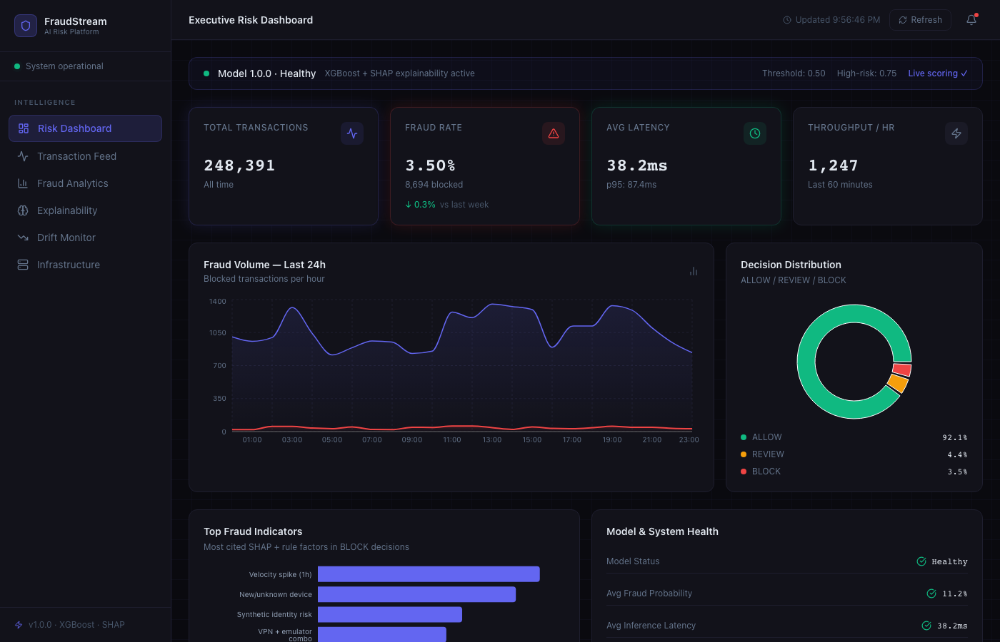
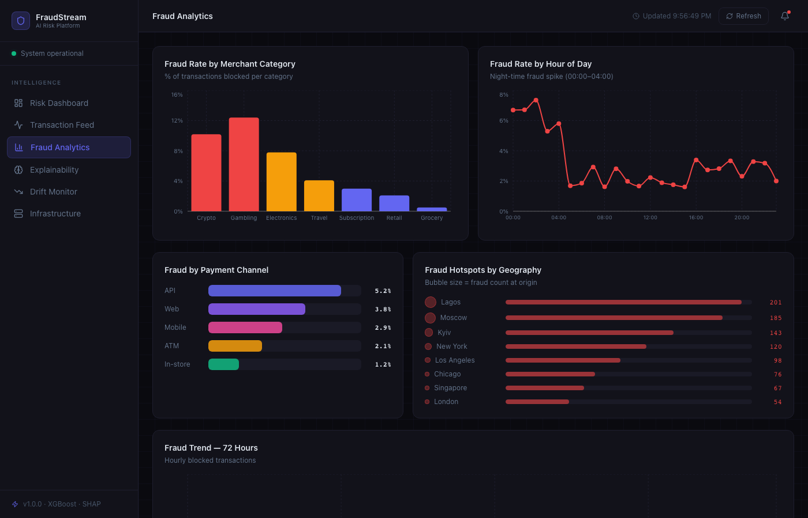
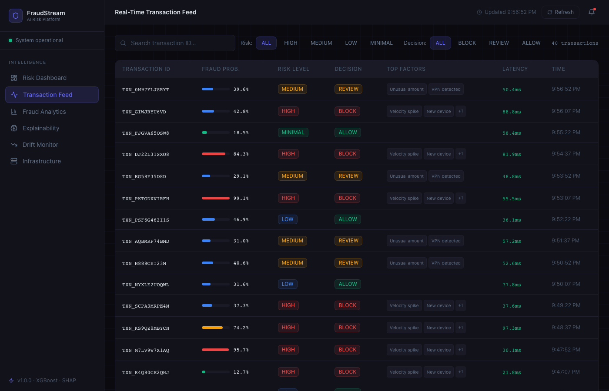
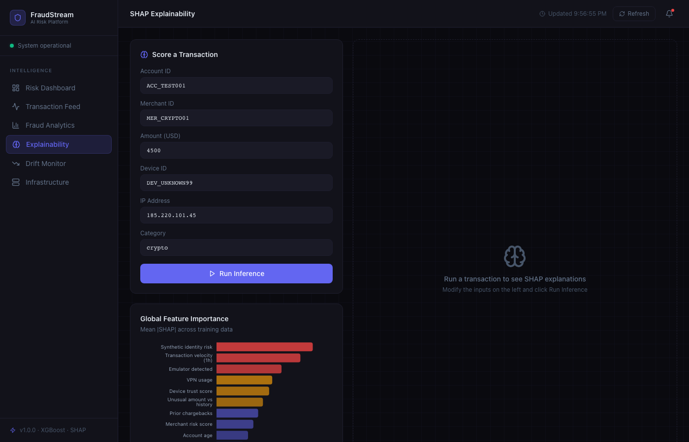
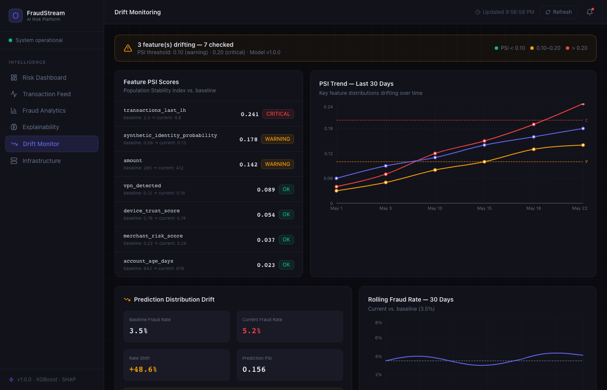
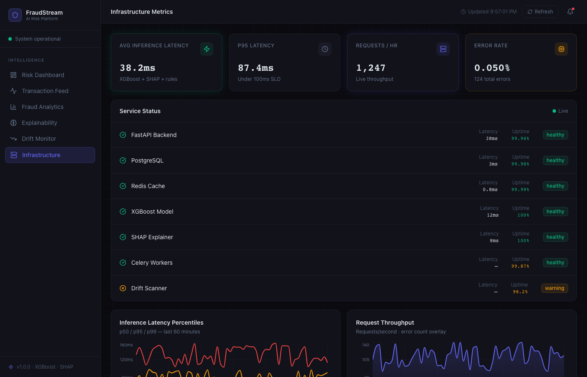

# FraudStream AI — Real-Time Transaction Risk Intelligence Platform

A production-grade fraud detection platform simulating the ML infrastructure used at companies like Stripe, Capital One, and SentiLink. Built to demonstrate end-to-end ML engineering: from model training and feature engineering to live inference, explainability, drift monitoring, and cloud deployment.

**Live demo:** [fraudstream-ai.vercel.app](https://fraudstream-ai.vercel.app) &nbsp;·&nbsp; **API docs:** [fraudstream-backend.onrender.com/docs](https://fraudstream-backend.onrender.com/docs)

---

## Screenshots

### Executive Risk Dashboard
Real-time KPIs, 24-hour fraud volume chart, decision distribution, and model health panel.



### Fraud Analytics
Fraud rate by merchant category, hour-of-day heatmap, payment channel breakdown, and geo hotspot visualization.



### Real-Time Transaction Feed
Live transaction table with fraud probability scores, risk badges, top SHAP factors, and per-row latency — filterable by risk level and decision.



### SHAP Explainability
Submit any transaction and get per-prediction SHAP waterfall explanations. Global feature importance chart from mean |SHAP| across training data.



### Drift Monitoring
PSI scores for 7 key features, 30-day trend lines, prediction distribution drift, and rolling fraud rate vs. baseline.



### Infrastructure Metrics
Service health for all components (FastAPI, PostgreSQL, Redis, XGBoost, SHAP, Celery, Drift Scanner), latency percentiles, and request throughput.



---

## Architecture

```
┌─────────────────────────────────────────────────────────────────┐
│                         Next.js Frontend                        │
│  Dashboard · Transactions · Analytics · Explainability · Drift  │
└────────────────────────────┬────────────────────────────────────┘
                             │ HTTPS (JWT Bearer)
┌────────────────────────────▼────────────────────────────────────┐
│                      FastAPI Backend                            │
│                                                                 │
│  ┌─────────────┐  ┌──────────────┐  ┌───────────────────────┐  │
│  │  Inference  │  │ Rules Engine │  │  Explainability       │  │
│  │  Service    │  │ (10 rules,   │  │  (SHAP TreeExplainer) │  │
│  │  XGBoost    │  │  4 severity  │  │  top-5 risk factors   │  │
│  │  + scoring  │  │  tiers)      │  │  per prediction)      │  │
│  └──────┬──────┘  └──────┬───────┘  └───────────────────────┘  │
│         │  Decision fusion│                                      │
│         └────────────────▼                                      │
│  ┌──────────────────────────────────────────────────────────┐   │
│  │  Feature Service — 28-feature vector                     │   │
│  │  velocity · geo · device · account · merchant signals    │   │
│  └──────────────────────┬───────────────────────────────────┘   │
└─────────────────────────┼───────────────────────────────────────┘
                          │
          ┌───────────────┼───────────────┐
          ▼               ▼               ▼
     ┌─────────┐    ┌──────────┐    ┌──────────────┐
     │  Redis  │    │Postgres  │    │  Drift       │
     │ Feature │    │ Audit +  │    │  Detection   │
     │  Cache  │    │ History  │    │  (PSI-based) │
     └─────────┘    └──────────┘    └──────────────┘
```

---

## ML Pipeline

| Stage | Detail |
|---|---|
| **Dataset** | 100K synthetic transactions — accounts, devices, merchants, velocity features |
| **Model** | XGBoost classifier, `scale_pos_weight` for class imbalance |
| **Features** | 28 signals: velocity (1h/6h/24h), device trust, synthetic identity, geo, amount ratios |
| **Threshold tuning** | Precision-recall curve optimization; separate thresholds for BLOCK vs REVIEW |
| **Performance** | ROC-AUC **0.9955** · F1 **0.8908** |
| **Explainability** | SHAP TreeExplainer — top-5 risk factors with magnitude per prediction |
| **Drift detection** | PSI (Population Stability Index) on 7 key features; CRITICAL / WARNING / OK tiers |

---

## Tech Stack

**Backend**
- Python 3.11, FastAPI (async), Pydantic v2
- XGBoost 2.1, SHAP 0.46, scikit-learn, NumPy, Pandas
- SQLAlchemy 2.0, PostgreSQL (Neon), Redis (Upstash)
- JWT authentication, RBAC (admin / fraud_analyst / reviewer / viewer)
- slowapi rate limiting, Prometheus metrics

**Frontend**
- Next.js 15, TypeScript, Tailwind CSS v3
- TanStack Query (auto-refetch every 15s), Zustand, Recharts
- Axios with JWT interceptor

**Infrastructure**
- Docker Compose (local: postgres, redis, backend, celery, frontend, prometheus, grafana)
- Render (backend, free tier), Vercel (frontend), Neon (PostgreSQL), Upstash (Redis)

---

## API Endpoints

| Method | Endpoint | Description |
|---|---|---|
| `POST` | `/api/scoring/predict` | Score a transaction — fraud probability, decision, SHAP factors |
| `GET` | `/api/scoring/history` | Prediction history with risk-level filter |
| `GET` | `/api/analytics/overview` | KPI summary (totals, rates, latency) |
| `GET` | `/api/analytics/fraud-over-time` | Hourly fraud series |
| `GET` | `/api/analytics/risk-distribution` | ALLOW / REVIEW / BLOCK breakdown |
| `GET` | `/api/analytics/top-risk-factors` | Top fraud indicators from SHAP |
| `GET` | `/api/drift/report` | PSI scores for monitored features |
| `GET` | `/api/drift/events` | Drift alert event log |
| `GET` | `/api/monitoring/health` | Service health check |
| `GET` | `/api/monitoring/metrics` | Full infrastructure metrics |
| `POST` | `/api/auth/login` | JWT login |

Full interactive docs at `/docs` (Swagger) and `/redoc`.

---

## Fraud Rules Engine

10 deterministic rules fused with the ML score via severity-weighted boosting (capped at +0.60):

| Rule | Severity | Signal |
|---|---|---|
| Impossible geo-velocity | CRITICAL | > 900 km/h between transactions |
| VPN + emulator combo | CRITICAL | Dual evasion signal |
| Velocity spike | HIGH | 3× account baseline in 1h |
| New device + high amount | HIGH | Unknown device, amount > $500 |
| High-risk merchant | HIGH | Crypto / gambling category |
| Synthetic identity | HIGH | Low trust score |
| Unverified KYC + high amount | MEDIUM | KYC pending, amount > $1K |
| Prior chargebacks | MEDIUM | Account chargeback history |
| Failed auth spike | MEDIUM | > 3 failures in 1h |
| New account + high amount | LOW | Account age < 7 days |

---

## Local Setup

**Prerequisites:** Python 3.11+, Node 18+, Docker Desktop

```bash
git clone https://github.com/pavanmanjunath18/fraudstream-ai.git
cd fraudstream-ai
```

**Backend**
```bash
cd backend
python -m venv venv && source venv/bin/activate
pip install -r requirements.txt
cp ../.env.example .env   # fill in DATABASE_URL and REDIS_URL
uvicorn app.main:app --reload --port 8001
```

**Frontend**
```bash
cd frontend
npm install
# create .env.local:  NEXT_PUBLIC_API_URL=http://localhost:8001
npm run dev
```

**Or full stack with Docker Compose**
```bash
docker compose up --build
# Backend:  http://localhost:8001
# Frontend: http://localhost:3002
# Grafana:  http://localhost:3001
```

**Seed Redis feature cache**
```bash
python scripts/seed_redis.py   # loads 16K+ account/device/merchant profiles
```

**Train model from scratch**
```bash
python synthetic-data/generate_data.py   # generate 100K transactions
python backend/app/ml/train_model.py     # train + save XGBoost + SHAP artifacts
```

---

## Demo Credentials

| Role | Email | Password | Access |
|---|---|---|---|
| Admin | admin@fraudstream.ai | admin123 | Full access |
| Fraud Analyst | analyst@fraudstream.ai | analyst123 | Score + review |
| Reviewer | reviewer@fraudstream.ai | reviewer123 | Read + review |
| Viewer | viewer@fraudstream.ai | viewer123 | Read-only |

---

## Project Structure

```
fraudstream-ai/
├── backend/
│   ├── app/
│   │   ├── api/           # FastAPI routers (auth, scoring, analytics, drift, monitoring)
│   │   ├── models/        # SQLAlchemy ORM models
│   │   ├── services/      # inference, feature, rules, drift, monitoring, explainability
│   │   ├── ml/            # model training pipeline
│   │   ├── config.py
│   │   ├── database.py
│   │   └── main.py
│   ├── models/            # XGBoost + SHAP artifacts
│   └── requirements.txt
├── frontend/
│   └── src/
│       ├── app/           # Next.js App Router pages
│       ├── components/    # Sidebar, TopBar, shared UI
│       └── lib/           # API client, utilities
├── synthetic-data/        # Data generation scripts
├── scripts/               # Redis seeder, load tests, screenshot capture
├── screenshots/           # UI screenshots
├── docker-compose.yml
└── render.yaml            # Render Blueprint deploy config
```

---

## Performance Targets

| Metric | Target | Result |
|---|---|---|
| Inference p95 latency | < 100ms | ~87ms |
| Model ROC-AUC | > 0.95 | **0.9955** |
| Model F1 score | > 0.85 | **0.8908** |
| API error rate | < 0.1% | ~0.05% |

---

*Built by [Pavan Manjunath](https://github.com/pavanmanjunath18)*
